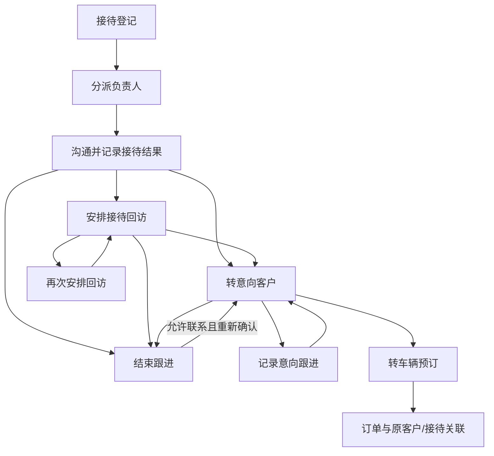
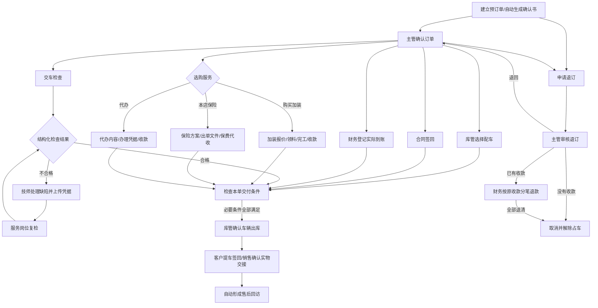
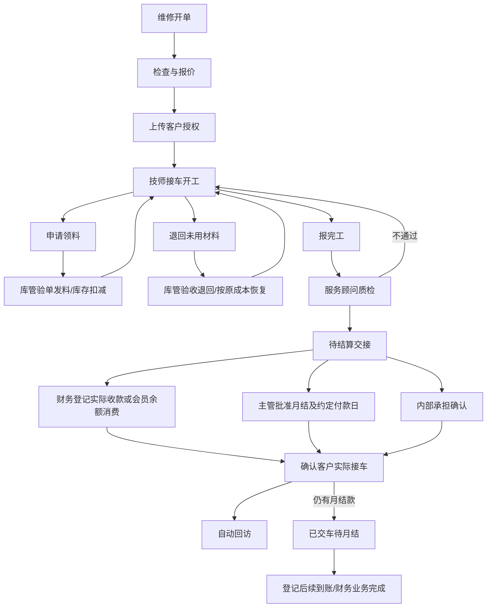

# 业务蓝图 · 本轮默认方案

本文件把用户授权的流程重塑目标落成一套**设计默认值**，不是声称原始需求已经规定这些规则，也不是照搬任何一家公司的内部制度。原表的模块与功能名称保留在覆盖表；后台实际流转以下列实现为准。

## 设计目的

员工不需要理解表与表的关系，只处理当前职责内的合法动作。可计算的信息由程序带出；需要真实判断的信息由员工确认。减少重复录入、重复联系和反复询问，不以待办数量作为个人绩效排名。

“任务生成”“任务完成”“现实事实确认”分离。系统能生成到账任务，但不能假装已经收到钱；能产生出库申请，但必须由经办人确认实物交接。

## 1. 售前：两个主要分支和正常退出

接待分派后，实际沟通者选择分支。无明确意向但愿意联系，填回访日期；无需继续跟进则结束并写原因。客户明确拒绝联系时，客户档案标记停止联系，未关闭回访只能选择结束；重新启用需主管确认。未联系上是一次联系结果，不应写成有效沟通。

客户按本店姓名与电话关联，同号不同名拒绝自动合并；同名同号复用。没有电话不能安排接待电话回访。没有实现跨门店自动客户共享和可靠去重主键，后续设计客户归属政策时要一起处理。

“转预订”复用客户并保存父子关系，订单继承销售负责人；不是复制一份无关联的客户。接待单转出后关闭相应待办，原历史保留。

## 2. 车辆订单：并行办理后汇合

未选服务不会生成空任务。合同签回与检查需先配车，生成的确认书能包括车架号；默认车辆款项全额收到，必要服务完成，才能出库。签回只认可本单、公司已启用模板、与当前业务快照一致的生成版本。签名真实性仍由公司复核，程序不替代验签。

版本 2 的交车检查必须明确选择合格／不合格并提供本单检测记录。不合格生成缺陷处理任务；处理之后才生成复检，复检仍不合格则再次处理。缺陷处理本身不等于检查通过，等待处理和等待复检均阻断出库。每次检查、处理与复检均追加事件，历史凭据不会被下一轮改写。新建业务使用版本 2；原版本 1 业务及其并行子任务保留旧目录、处理器和历史。出于明确的交付安全策略，版本 1 车辆订单暂停检查、出库和提车动作；管理员须另行评审升级及重新检查方案。本轮未提供旧单迁移接口，不会自动把旧文本结论判为合格或重写历史；未知版本拒绝执行。

订单总状态保持“交付准备中”，不同任务可分别为未开始、已完成或受阻。岗位任务显示接手人和原因。对于付款多次到账，允许分笔并保留每笔凭证，累计达到约定金额时才关闭收款任务。

一辆车只能被一个有效订单占用，新旧业务同时校验。出库与客户实际提车分别确认。当前系统在实际提车时将占车标记为已交付，出库至提车间仍是被锁定车辆；尚无独立“出库在途库存”统计。

退订默认只支持尚未出库且附加服务尚未实际开始的订单。执行过的服务、已经出库/已提车的业务不能简单取消，必须后续开发正式退车和费用结算。退款按原收款账户、原流水剩余可退金额处理，全部退清后解除车辆占用。既有事实不会用删除按钮抹除。

## 3. 维修：施工与结算分开

开单类型覆盖一般维修、保养、洗车、保险理赔、厂家索赔、返修、新车检测，但当前共用主要报价授权路径，不是假装每一类都有完整行业特化流程。没有独立预约日历、工位排程、工时排班。

报价为工时/配件/优惠汇总和文字施工项目，不是可扩展明细行。一个工单一个结算承担方：客户、保险公司、厂家、内部；没有多方拆账和核损/索赔全链路。授权后不允许直接改价；新增项目的正式变更单是下一轮重点，不能靠改备注代替授权。

未完成的领退料必须处理后才能完工/质检；退料数量不得超过原领料尚未退回数量。质检与实际收款独立，未收齐必须有主管批准月结才能交还客户。内部承担不生成客户应收及现金收入。维修月结仅是工单层面的信用交车与后续到账，并非完整月底对账/封账。

会员余额只能用于本店、同一客户的维修结算，消费不会再产生一笔外部现金收入。

## 4. 物资：实物确认后记库存

采购申请（单项物资、数量、单价）→主管复核→到货验收凭据→实际入库。当前为全量一次到货，不支持多项采购单、部分到货、供应商对账或采购付款。

维修/加装业务申请领料→库管确认发出→建立不可改写的物资流水→按库存价值计算出库成本并计入父业务直接成本。退料引用原领料，恢复对应成本、降低父业务已耗材料成本。数量用千分之一单位，金额用分，余数保留在库存价值中，不凭浮点平均价反复舍入。

盘点建立时保存账面数量与版本→主管按凭据复核→写入差异流水。盘点期间物资又有变动则拒绝过时结果，要求重新清点/核对，不能用旧数量覆盖新出入库。

**跨店车辆/物资调拨、店内移库、采购退货、耗材/礼品特殊出入库目前未实现。** 规划拓扑是“申请→发出店批准→实物发出进入在途→接收店验收→差异处理→确认入库”。双方单据共享调拨标识，但不能直接改原记录门店。实现前不要用库存直接改数冒充调拨。

## 5. 客户、保险与会员

交车和维修接车生成回访任务；保险登记出单后生成到期前30日的续保联系任务。回访可记录结果、安排下一次、转新购车意向、转投诉或结束。这里已有分派/转交通用能力，但没有独立续保线索批量提取和专门回访话术系统。

投诉：登记→主管制定方案并设日期→客服/售后落实并上传凭据→确认结果→需要时主管重新打开。紧急救援调度、问卷、保养里程计算尚未实现。

会员充值申请不增加余额；财务确认实际充值后才写储值流水。退款申请经主管批准后先占用相应可用余额，避免待退的钱又被消费；实际退款后减少总余额。当前不校验外部银行原路退回结果，依赖经办人凭据；不得把“登记退款”当成系统已经调用支付接口。

版本 2 增加两项异常出口：主管可取消已批准但没有到货／付款流水的物资采购；主管或财务可撤销已批准但没有真实退款流水的会员退款。取消采购不写入负库存或退款，撤销会员退款仅释放本申请占额、不改变储值总额或现金。相反操作竞争时通过申请和库存／会员版本保护，不能既取消又实际入账。已发生的到货和退款仍必须用关联原始事实的纠正流程处理，本轮不允许用取消按钮掩盖。

## 6. 分工与交接默认值

| 岗位 | 主要责任 |
|---|---|
| 前台 | 登记接待、分派、记录必要联系信息 |
| 销售 | 意向判断、报价/预订信息、合同签回、客户提车 |
| 库管 | 配车、车辆出库、物资到货/发料/退料 |
| 服务顾问 | 维修报价/客户授权、质检、保险代办、接车交接 |
| 技师 | 接车开工、领退料申请、施工完工 |
| 财务 | 对照原始凭据登记实际收款/退款、余额结算、开票结果 |
| 客服 | 客户回访、投诉处理、会员业务申请 |
| 店长 | 授权与复核、例外批准、岗位转交、模板确认 |
| 管理员 | 初始化、账号和门店管理；保留明确管理覆盖权限并留痕 |
| 审计 | 查询及数据复核，不改变业务事实 |

按岗位创建任务时，优先分给本店该岗位当前未完成任务较少的员工；缺岗时由店长/管理员兜底，**实际收退款只交财务或管理员**。这是小团队默认调配策略，不是绩效算法。未设置工时、休假、轮班或工作日历，不承诺自动优化休息时间。长期使用前可按实际排班替换分派策略。

任务转交由主管操作，带出原因与原接手人，新接手人立即获得这项任务对应的业务访问权。原经办人可能保留历史查询权，不等于继续有权代替接手者处理任务。不是所有节点都额外要求接单按钮，本轮以确定的责任分配减少点击。

## 7. 文件输入与输出

| 节点 | 输入 | 输出/留痕 |
|---|---|---|
| 接待/沟通 | 可选客户提供资料、沟通原件 | 关联客户和接待历史、业务记录DOCX |
| 预订 | 客户与车型、金额、服务选择 | 自动生成订购确认书、模板版本、业务快照 |
| 配车 | 实际可用车辆选择 | 更新后的订购确认书版本 |
| 合同确认 | 对应版本的签回照片/扫描件 | 签回关联、员工确认事件 |
| 收退款 | 到账凭据、账户、流水号、金额 | 不可直接改写的收退款记录及账目关联 |
| 施工/库存 | 授权、领退料/到货/盘点凭据 | 施工记录、物资流水、成本变化 |
| 交付 | 检测记录、实际交接签回件 | 交付确认单、实际交付日期及后续回访 |
| 开票 | 外部已开票文件和号码 | 与原业务关联的开票登记，不调用税务系统 |

任何流程单都可附加原始资料与生成通用业务记录。无需OCR，不把上传文件的未经核对内容自动写进账。文件与本人可见业务绑定，不能用猜测文件编号跨店下载。
