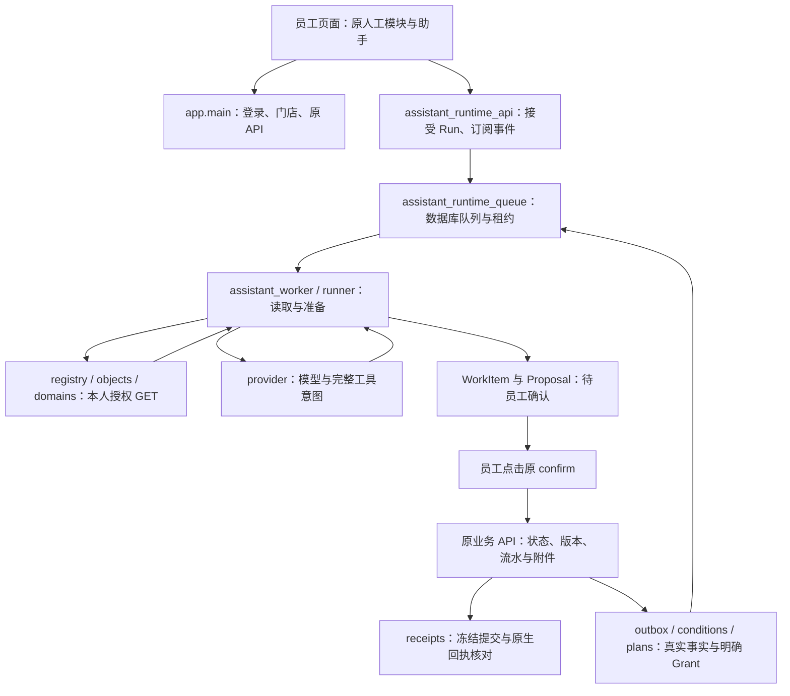

# 维护交接：从源码到业务确认

本文面向接手当前 Git 源码的开发者和编码模型，解释入口、职责和维护路径。产品合同查 [PROJECT_SPEC](../PROJECT_SPEC.md) 与 [ARCHITECTURE](../ARCHITECTURE.md)；开发限制查 [AGENTS](../AGENTS.md)。唯一实施状态仍在 [implementation_plan](../implementation_plan.md)，本文不保存第二套状态表。

2026-10-05 用户保留本地真实模型复验，撤回尚未执行的 HTTPS/OS 输入法和独立 Windows/Linux 验收任务。撤回不表示通过，也不取消业务权限、人工确认和生产安全合同。具体范围见[范围补丁](implementation-patches/PATCH-SCOPE-MAINTENANCE-20261005-01.md)。

## 模块与数据流



图中的队列、计划和卡片是助手记录，原业务 API 才拥有销售、维修、财务等状态机。模型没有确认工具；跟进授权不等于付款、交接或业务提交。用户 Run 的原输入与入队同事务保存，事件以 `seq` 补读；断开页面订阅不等于取消 Run。

| 模块组 | 实际入口与职责 |
|---|---|
| Web 与身份 | [app/main.py](../app/main.py)、[security.py](../app/security.py)、[tenancy.py](../app/tenancy.py)：登录、Cookie/CSRF、当前门店岗位、原路由 |
| 数据与迁移 | [db.py](../app/db.py)、[models.py](../app/models.py)、[migrations](../migrations/)：业务库、连接与追加迁移；Runtime 表在自己的 models 模块注册 |
| 助手 HTTP 与兼容层 | [assistant_runtime_api.py](../app/assistant_runtime_api.py)、[business_assistant_api.py](../app/business_assistant_api.py)、[business_assistant_service.py](../app/business_assistant_service.py)：Run、旧消息、卡片与原确认 |
| 队列与执行 | [assistant_worker.py](../app/assistant_worker.py)、[assistant_runtime_queue.py](../app/assistant_runtime_queue.py)、[assistant_runtime_runner.py](../app/assistant_runtime_runner.py)：领取、fence、完整工具边界与恢复 |
| 模型与上下文 | [assistant_runtime_provider.py](../app/assistant_runtime_provider.py)、[assistant_runtime_context.py](../app/assistant_runtime_context.py)、[assistant_runtime_events.py](../app/assistant_runtime_events.py)：SSE、预算、有来源快照与安全展示 |
| 原业务适配 | [assistant_runtime_registry.py](../app/assistant_runtime_registry.py)、[assistant_runtime_objects.py](../app/assistant_runtime_objects.py)、[assistant_runtime_domains](../app/assistant_runtime_domains/)：固定工具与对象分派、原授权 GET、三值事实 |
| 计划与跟进 | [assistant_runtime_plans.py](../app/assistant_runtime_plans.py)、[assistant_runtime_conditions.py](../app/assistant_runtime_conditions.py)、[assistant_runtime_outbox.py](../app/assistant_runtime_outbox.py)：DAG、Grant、原事务 signal 与依赖核对 |
| 回执与完整性 | [assistant_runtime_receipts.py](../app/assistant_runtime_receipts.py)、其 common/commercial/care/inventory 模块、[assistant_runtime_integrity.py](../app/assistant_runtime_integrity.py)、[business_assistant_plan_integrity.py](../app/business_assistant_plan_integrity.py)：冻结提交、固定族回执、原图守卫 |
| 前端 | [web/app.js](../web/app.js)、[businessassistant.js](../web/businessassistant.js)、[assistantruntime.js](../web/assistantruntime.js)、[assistantworkspace.js](../web/assistantworkspace.js)：原导航、草稿/补填/确认、Run 与工作台 |
| 私有附件 | [private_files.py](../app/private_files.py)、[private_file_backup.py](../app/private_file_backup.py)：对象授权、不可替代的扫描资格、数据库与对象联合恢复 |
| 运维反馈 | [ops_feedback_api.py](../app/ops_feedback_api.py)、[ops_store.py](../app/ops_store.py)、[ops_worker.py](../app/ops_worker.py)、[ops_mcp.py](../app/ops_mcp.py)、[ops_context.py](../app/ops_context.py)：独立意见队列、只读源码和修改建议 |
| 运维邮件 | [huakangos_ops_mail.mjs](../scripts/huakangos_ops_mail.mjs)：固定评审收件人、独立 outbox、邮件结果核对；不自动修代码或合并 Git |

`task_views.py` 只叠加原授权查询；分页前先按权限过滤。前端导航层 `businessux.js`、`moduleworkspaces.js` 和 `workforms.js` 不拥有业务事实或提交权限。临时草稿和答案只在当前会话内存，换店/退出清理上下文并丢弃迟到响应。

## 五条读码路径

1. **一次员工请求。** 从 `assistant_runtime_api.accept_run` 读入参和同请求号合同，再读 queue 的入队/领取、`assistant_worker.Worker.tick`、`runner.run_once`。最后读 provider、context 和 events，确认外发前重验与持久预算；不要从模型文字推导业务成功。
2. **准备到确认。** 从 registry/objects/目标 domain 找原 operation 和 GET，再读 `business_assistant_service.resolve_preparation`、`persist_preparation`。员工确认由 `business_assistant_api` 的原 confirm 路由进入 `confirm_proposal`/`decide_proposal`，最后由原业务 API 执行守卫和事务；卡准备只保存助手记录。
3. **明确开启跟进。** 从 plans 的 followup 控制读本人、`goal_version` 与 Grant，再读 outbox、conditions 和 queue。后台只在真实前置成立时准备；暂停/撤销不冲回原业务，退出登录后的 Grant 仍受即时权限重验。侧栏展示查 workspace，不能用通知已读或任务消失证明完成。
4. **页面与交互。** 从 `web/index.html`/`app.js` 看脚本加载与路由，再读 businessassistant 的卡 ID、补填和确认，assistantruntime 的订阅代际，assistantworkspace 的计划与通知。文件路径查 `businessassistantfiles.js`：员工选择、预览、审阅后显式发送，解析结果不是业务证据。
5. **意见与评审。** 从 `web/feedback.js` → ops_feedback_api → OpsStore 的原员工意见，再读 ops_worker、ops_mcp、SourceContext 和 Node mail outbox。Web 回执表示意见已收到；运维输出是待评审建议，邮件 `sent` 表示服务接受，不是 Cutie 已审阅或修复已发布。

读恢复问题时先找原记录与具体失败阶段，再核同一 WorkItem、请求号、fence 和冻结提交。不能删除失败记录或另换请求号重放未知结果。

工具格式拒绝发生在 `runner.run_once` 的完整列表校验处：整段工具均未执行，当前内存工具链携带具体拒绝结果供模型纠正，仍使用同一轮数和费用预算。这个内存链不是持久检查点；检查点内拒绝、权限失效及结果不明不能沿这条格式纠正路径重试。

查询结果的单位和范围由原接口定义：`flow_api.describe_case` 的 `data_fields` 按原流程版本提供金额/数量换算，不能把分或千分之一当展示值。`vehicle_catalog_service` 返回当前在库车型组和独立分页的未分类车辆；`vehicle_period_analytics` 的历史核对行不等于当前库存。Runtime 的 `business_date/timezone` 每轮由服务器时钟生成，历史摘要不保存“今天”；看板用 `end/days`，其默认30天不等于自然月。维护查询逻辑时先核实际返回范围，再改助手说明。

维修领退料子单的创建字段为空，数量来自原维修动作的 `QTY`；详情投影须保留这条来源，计量单位只读取当前门店且本人可见的原 `Item.unit`，缺失保持未知。旧 `flow_members` 与集团会员身份是不同记录；旧会员选择器和档案查询按本店卡号或对应客户姓名检索，新集团身份为空不能据此否定旧余额。卡片补填只能收集员工事实，`version` 与各 `*_version` 都由原查询提供，不能让员工猜填。

`flow_analytics` 的原待收款表包含多种承担方；行级 `payer_type` 是原业务事实的补充，缺失不能按“客户”列猜定，混合合计也不能冒充筛选后的客户合计。工作流帮助的 `entry.can_enter` 只说明入口岗位匹配；具体旧单的版本、父单权限和可办动作仍由原授权详情判断。

Flow 报表用 `date_from/date_to`，省略首日时沿用结束日前29日；返回的 `scope` 区分实际现金期间与当前库存/待收等快照，不改变原统计。自然月必须明确传首末日并核对结果。`find_cases` 保留原 API 已提供的 `flow_version/version/parent_id`，候选可见仅证明可检索；选定原单后仍按本人详情和父单权限判断可办动作。

Runtime 保存查询 WorkItem 时，`runner._read_intent` 先经原 gateway 参数校验，再把原生日历日期转为 ISO 字符串并通过有限 JSON 检查。首次和恢复使用相同意图表示；实际 GET 仍使用原参数验证。不要用通用 `default=str` 或全局数据库序列化器掩盖未知类型，也不要为持久化而改原 API 的日期类型。

## 进程、存储与配置归属

| 进程 | 启动入口 | 必须预先准备 |
|---|---|---|
| 业务 Web | `python -m app.run` | 自己的配置、已迁移业务库；普通启动不嵌入 Runtime worker |
| 业务 Runtime worker | `python -m app.assistant_worker`；可用 `--once`、`--health` | 显式业务实例与迁移；同 Web 的数据库、附件根、业务助手配置 |
| Windows 本地预览 | [start-preview.cmd](../start-preview.cmd) / [start-preview.ps1](../start-preview.ps1) | 外部预览实例与仓库身份；只有验证的预览可嵌入 worker，不重置已有账号 |
| 日报 worker | `python -m app.report_worker` | `SCHEDULER_ENABLED=true`、`SCHEDULER_MODE=worker`；Web 不再执行日报 tick |
| 运维 MCP | `python -m uvicorn app.ops_mcp:app --host 127.0.0.1 --port 28761 --workers 1 --no-access-log` | 私有 `OPS_CONFIG`、独立状态库与核过 SHA 的源码 manifest |
| 运维 worker | `python -m app.ops_worker`；可用 `--once` | 同运维状态库、自己的模型密钥和固定 loopback MCP；新运维库用其 `--init-db <绝对路径>` 初始化 |
| 运维邮件 MCP | `node scripts/huakangos_ops_mail.mjs --config <私有配置绝对路径>` | Node 24、独立邮件库/角色 token，以及当前代码要求的外部 SMTP 模块与配置 |

业务库由 `app.cli`/Alembic 管理，迁移链包括 `h52j_assistant_work_plans`、`h53k_assistant_runtime`；实例版本看实际迁移记录。OpsStore 初始化自己的 SQLite schema，不使用业务 Alembic；Node mail 也只管理自己的 outbox。不要把这三份库连成同一数据库来“方便启动”。

| 配置 | 消费者与含义 |
|---|---|
| [.env.example](../.env.example) / 自己的 `.env` 或环境变量 | `app.config`：`DATABASE_URL`、Host/Cookie、时区、扫描/私有附件和日报；不要复制别人的真实 `.env` |
| 四个 `ASSISTANT_*_ENABLED` | home/runtime/followup/notifications，默认关闭；followup 要求 runtime；验证显式开启不等于授权公司实例启用 |
| `BUSINESS_ASSISTANT_CONFIG` | 业务助手外部绝对 JSON 路径；enabled/provider/model/api_key/timeout/tool_profile 与 24 轮、600 秒默认预算由 `business_assistant_service.load_config` 解析，不接受任意 endpoint |
| `DEEPSEEK_*` 与 `ALLOW_AI_EXTERNAL` | 原日报聚合 AI；与业务助手 JSON 配置不同，不能据此推断业务模型就绪 |
| `OPS_STATE_DB` | Web 意见入口使用的已初始化外部运维库路径；Web 不替运维初始化库 |
| `OPS_CONFIG` | ops_worker/ops_mcp 私有 JSON；source_root/state_db 与三份互不相同的 agent/worker/reviewer token，自己的模型密钥路径、固定 loopback endpoint |
| Node `--config` | 邮件 token/port/dbPath/enabled/senderModule/credentialsFile；仅邮件进程读取 SMTP 凭据，不交给 Web 或模型 |

员工登录 Cookie/CSRF、业务模型 key、运维模型 key、运维三个角色 token 和 SMTP 凭据各有用途，不能互换或写入事件/报告/Git。原始推理只留本次工具链内存。`OPS_CONFIG` 和 `BUSINESS_ASSISTANT_CONFIG` 不是 HTTP 客户端可以自报的权限。

模型模式由本次请求的`thinking`明确决定，重试保持原值；开启时DeepSeek使用`high`推理强度、MiMo保留`low`，关闭时保留原温度。UI、HTTP缺省及后台模式不能根据一份显式开启的评测报告推定已改变。响应中不完整的工具参数JSON必须拒绝；不要通过修补JSON、自动重发未知Run或保存原始推理来提高通过率。当前模式复验见[M8.5对照记录](implementation-checkpoints/M8-5-mode-comparison-review-v1.md)。

当前运维服务还有部署专用依赖：邮件模块固定指向 `/opt/dsh-codex-status/src/status/qq-smtp.mjs`，示例 service 的 Node 可执行路径也是原部署路径；`ops_context.snapshot()` 的 candidate bundle/branch 也是原交接标识。它们不由 Git 克隆生成。新环境须核对实际组件与自己的服务路径，不能直接照搬示例或宣称完整邮件环境已自包含；本次维护没有替换 SMTP 实现。源码检查使用注入 sender，不发送真实邮件。

## 新环境开发与数据库维护

从 Git 克隆进入项目根，使用 Python 3.11–3.13 建立独立虚拟环境并安装 [requirements.txt](../requirements.txt)。前端无 npm 构建。普通开发不需要任何模型、SMTP 或运维凭据。

创建自己的配置前，先选仓库外的全新开发数据库、附件和备份目录，并把 `DATABASE_URL`、附件相关设置绑定到这些位置。默认配置是本地开发，不是生产安全配置。新实例才使用 `python -m app.cli init` 创建首个管理员，再运行 `python -m app.run`；不要对公司或别人预览实例做初始化练习。[start.ps1](../start.ps1)/[start.sh](../start.sh) 会安装依赖并调用初始化，已有数据维护应先明确备份与迁移流程。

PostgreSQL 使用 [requirements-postgres.txt](../requirements-postgres.txt) 的 psycopg 驱动，服务器及 `initdb`/`pg_ctl`/`pg_dump`/`pg_restore` 工具另行提供。驱动安装不能代替准备数据库。原迁移只追加，不使用 `Base.metadata.create_all` 替代已有库升级。

SQLite 的实际管理入口如下；路径均选自己授权的仓库外目录：

```text
python -m app.cli backup --output <全新备份文件或联合备份目录>
python -m app.cli verify-backup <联合备份目录>
python -m app.cli restore-backup <联合备份目录> --output <全新恢复目录>
python -m app.cli migrate
python -m app.cli check
```

`backup` 在存在私有对象或 private_local 模式时要求数据库与对象联合备份；`verify-backup`/`restore-backup` 用于联合目录，恢复不会自动切换活动配置。先在副本迁移并验证恢复，核原行、附件和 Runtime 图，再按授权升级原实例。PostgreSQL 不支持此 SQLite backup 命令，须原生 dump/restore 与私有对象清单一起验证；不能只备库丢附件。`scripts/migrate_database.py` 用于明确的源/目标迁移，原目标非空拒绝、指纹与私有对象守卫保留；不是日常启动入口。

上传文件通过结构校验不等于病毒扫描或签字确认。生产仍要求 HTTPS、安全 Cookie、明确 Host、ClamAV、禁止 legacy write 和独立验收；开发运行说明不构成部署授权。

## 验证材料与交付边界

Git 中的源内检查可以在新的外部合成目录运行。运维检查使用 [tests/ops_review/run_isolated.py](../tests/ops_review/run_isolated.py)，先安装该检查需要的 pytest 与 Node 24，再通过它镜像执行。浏览器检查使用 [tests/browser_click/run.py](../tests/browser_click/run.py) 和 Playwright/明确浏览器入口，直接导航隔离服务，不用 Cookie/fetch 桥替代。具体命令参数先查各入口源码；当前普通 CI 没有浏览器任务。

完整归档回归、原 101/283 模型定义、冻结提示词、runner/harness/依赖锁与历史原件是另行交付的验证材料。新维护者先核材料清单/SHA，再让其统一入口绑定当前 Git 源码和全新的外部根；不需要复用本机历史 V 路径。没有这些材料就只报告已执行的源内检查，不能据映射、静态审查或局部诊断宣布完整验收。

真实模型执行按 [DEEPSEEK_TESTING_HANDOFF](../DEEPSEEK_TESTING_HANDOFF.md) 和实施计划的 live gate；使用合成员工/业务夹具、原场景和共享预算，记录真实请求、retry 与 usage。未知 usage/cost 保留未知，不按零处理；不开公司数据库，不让模型直接确认业务。

工作流来源是 `docs/workflow-source/`，用 [build_workflow_guides.py](../scripts/build_workflow_guides.py) 生成；193 项需求映射、111 条发布工作流、页面和业务验收各自记证据，不混成一个通过数。

[package_source.py](../scripts/package_source.py) 从当前工作树白名单打包到仓库外全新 ZIP，排除 Git 历史、测试/CI、外部验证胶囊、依赖环境、数据和凭据。源码 ZIP 用于代码与运行说明交付；维护测试优先 Git 克隆，完整验证材料单独交付。员工试用、待人工验收与生产验收仍由对应人员实际完成。
